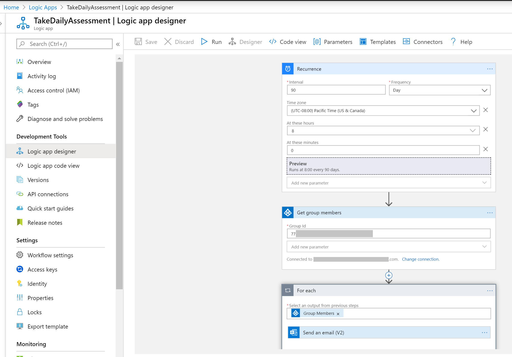

# Step 7: Send automated email notications using Azure Logic Apps

To send automated notifications, create 2 logic apps as follows:
### Logic App 1: Send HTTP triggered email notification with link to Bot for Registration 
You can use this link to create a 
	- [HTTP triggered](https://docs.microsoft.com/en-us/azure/connectors/connectors-native-reqres) app with Azure AD integration and Send email function

### Logic App 2: Send Recurrence based email notification with link to Bot for Taking Daily Assessment
You can use this link to create a 
	- [Recurrence Trigger](https://docs.microsoft.com/en-us/azure/connectors/connectors-native-recurrence) app with Azure AD integration and Send email function

